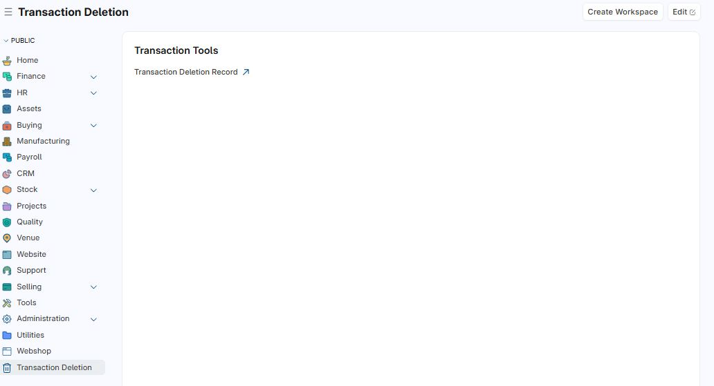
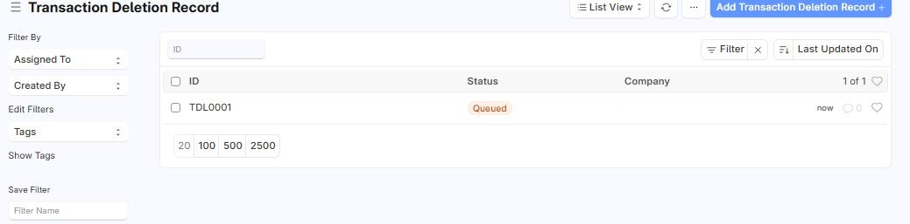
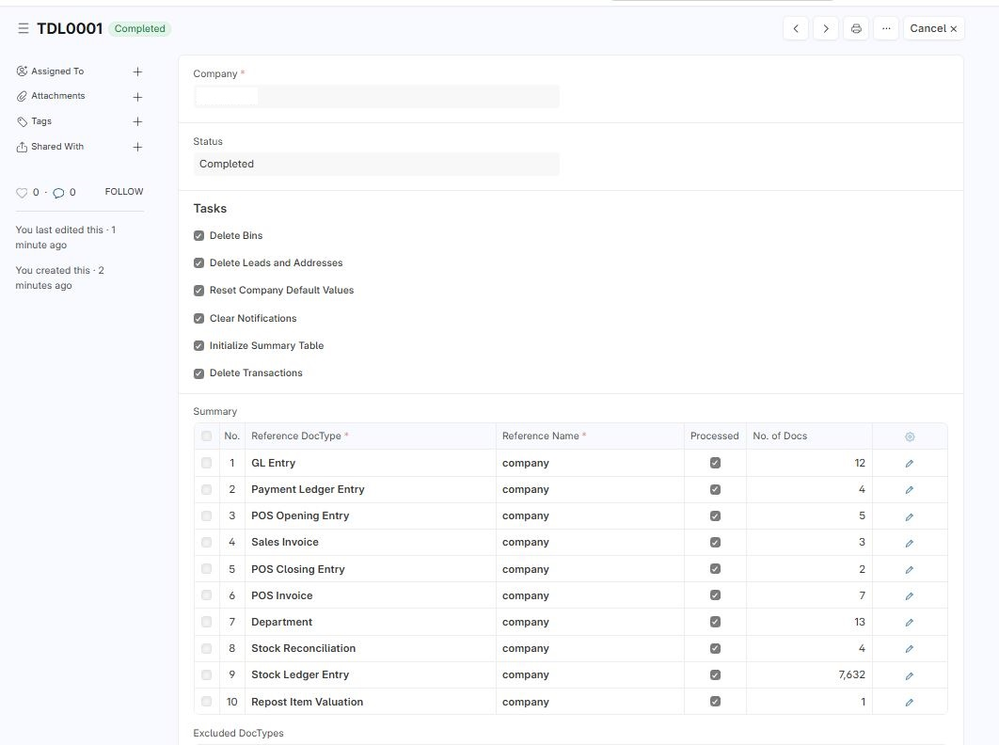
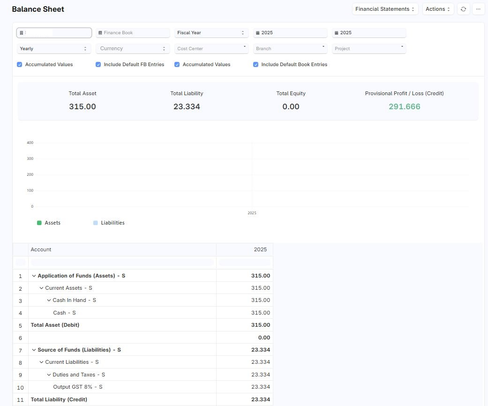

# Transaction Tools


<h3>📸 Screenshots (Scroll to view)</h3>

<div style="display: flex; overflow-x: auto; gap: 16px; padding: 8px 0;">
  
  
  
  
</div>

Tools for deleting all transactions for a company in **Dokos v4**.

## Overview

This app provides utility functions and a dedicated doctype (`Transaction Deletion Record`) to clear all transactional data for a specific company. It's designed for developers or administrators who want to reset test data from a site without affecting core master data.

> ⚠️ **Use with caution**: This tool **permanently deletes** transactional records. It is intended for development or test environments only.

---

## ✅ Features

- Delete all sales, purchase, stock, and accounting transactions for a company.
- Supports selective deletion with options for bin, leads, and notifications.
- Simple interface via the `Transaction Deletion Record` DocType.
- Extensible and modular for custom doctypes.

---

## 📦 Installation

This app is compatible with **Dokos v4**. 

```bash
cd /path/to/your/bench
bench get-app https://github.com/shuhain85/transaction_tools
bench install-app transaction_tools

